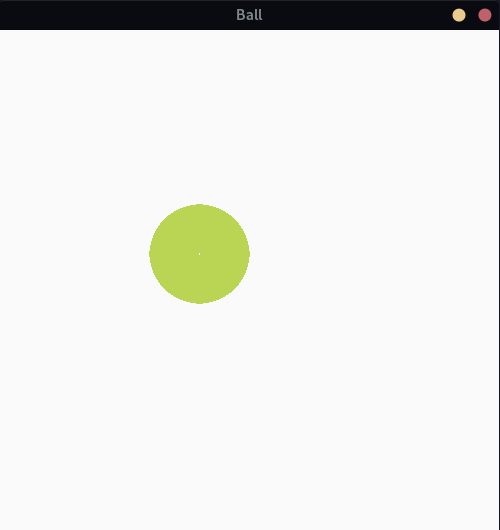

Ball
=======

This program creates a ball that moves without the need for a controller. By tapping on the form wall, the direction changes. (Like Zero Player games) It's written with the Pygame library, and I'm not good at it. *I wrote it for the love of the mothers of the world and their kindness*



using python version
====================

step1
-----

install pygame library

```
pip install pygame
```

step2
-----

run the code

```
python Ball.py
```


using c version
===============


c version needs compiling. if you using Unix os, you can compile like this:

```
gcc Ball.c
```

if You using Windows os You can use IDE for compiling like this dev-c++.
